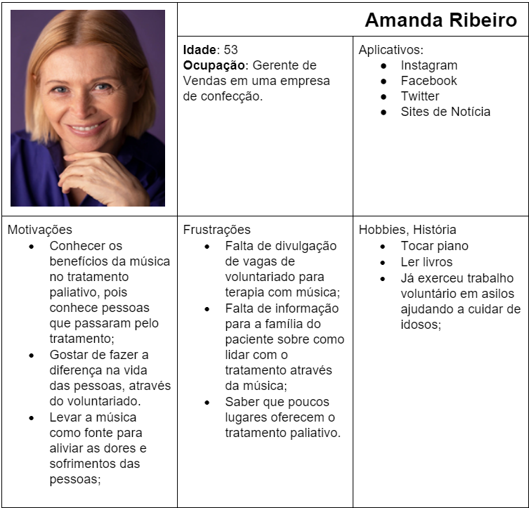

# Especificações do Projeto

Pré-requisitos: <a href="1-Documentação de Contexto.md"> Documentação de Contexto</a>

A definição exata do problema e os pontos mais relevantes a serem tratados neste projeto foi consolidada com a participação dos usuários em um trabalho de imersão feita pelos membros da equipe a partir da observação dos usuários em seu local natural e por meio de entrevistas. Os detalhes levantados nesse processo foram consolidados na forma de personas e histórias de usuários

## Personas

As personas levantadas durante o processo de entendimento do problema são apresentadas na Figuras que se seguem.

## Histórias de Usuários

Com base na análise das personas forma identificadas as seguintes histórias de usuários:

|EU COMO...                    |QUERO/PRECISO ...    |PARA ...                    |
|---------------------------- |------------------------------------|----------------------------------------|
|Adriano Oliveira             | poder encontrar mais informações sobre o tratamento paliativo com música    | para entender sobre seus objetivos e discutir com amigos e familiares  |
|Amanda Ribeiro      | quer se cadastrar no site                 | para se voluntariar  |
|Adriano Oliveira    | buscar por pessoas e saber sobre suas habilidades músicas                  | para poder se conectar e trocar experiências |
|Amanda Ribeiro        | encontrar locais em sua região, que precisem de voluntários para o tratamento paliativo com música                  | para poder exercer o trabalho voluntário nesses locais  |
|Adriano Oliveira         | pesquisar sobre instituições e grupos já cadastrados                 | para poder exercer o trabalho voluntário nesses locais |
|Adriano Oliveira       | pesquisar sobre instituições e grupos já cadastrados                 | para saber se já existe algum grupo com projeto em andamento em alguma instituição |
|Amanda Ribeiro       | poder compartilhar as informações do site nas minhas redes sociais                  | para divulgar o projeto para o maior número de pessoas possíveis |
|Amanda Ribeiro       | saber como apoiar o projeto financeiramente                 | pois acredito nessa iniciativa |
|Adriano Oliveira       | conseguir acessar o site também do celular                 | pois é o aparelho que mais utilizo para acessar a internet |
|Amanda Ribeiro       | poder encontrar uma sessão com galeria/vídeos e ou comentários de ações sociais que já foram promovidas                | para conhecer um pouco mais do projeto |
|Adriano Oliveira       | poder conseguir entrar em contato com o projeto Encante com Música                | para sanar dúvidas |
|Jeferson Silva        | quer realizar solicitação de visita de voluntários musicais                 | para a sobrinha que está em tratamento do câncer |
|Hospital N. Senhora       | poder cadastrar a instituição para receber voluntários                  | pois quer oferecer a música como forma de tratamento para seus pacientes |
|Luana Oliveira       | Quer solicitar a visita dos voluntários no hospital                 | pois está com câncer e sente que a música alivia sua dor |

## Requisitos

As tabelas que se seguem apresentam os requisitos funcionais e não funcionais que detalham o escopo do projeto.

### Requisitos Funcionais

A tabela a seguir apresenta os requisitos do projeto, identificando a prioridade em que os mesmos devem ser entregues.

|ID         | Descrição do Requisito  | Prioridade |
|------     |-----------------------------------------|----|
|RF-001     | O site deve apresentar uma página com informações sobre o tratamento paliativo com música. | ALTA | 
|RF-002     | O site deve apresentar uma página com a história do projeto.   | ALTA|
|RF-003     | O site deve apresentar uma página com notícias relacionadas ao tratamento paliativo com música.   | MÉDIA|
|RF-004     | O site deve permitir que o voluntário realize login e senha após cadastro.   | ALTA|
|RF-005     | O site deve permitir que a instituição médica/hospitalar realize login e senha após um cadastro.s   | ALTA|
|RF-006     | O site deve permitir que o voluntário realize buscas por categorias instrumentais e categorias de vozes.   | ALTA|
|RF-007     | O site deve permitir que o voluntário pesquise instituições e grupos cadastrados.   | ALTA|
|RF-008     | O site deve permitir que o voluntário pesquise locais em sua região que precisem de voluntários.   | ALTA|
|RF-009     | O site deve apresentar como o voluntário pode apoiar financeiramente o projeto.   | BAIXA|
|RF-010     | O site deve permitir visualizar as informações de contato do mantenedor do site  | MÉDIA|
|RF-011     | O site deve permitir encontrar uma sessão com galeria/vídeos e comentários de ações sociais que já foram promovidas   | ALTA|
|RF-012     | O site deve permitir compartilhar informações nas redes sociais   | MÉDIA|
|RF-013     | O site deve permitir que o usuário entre em contato com o projeto para sanar dúvidas através de mensagem de texto.   | ALTA|
|RF-014     | O site deve permitir que pacientes e familiares entre em contato com o projeto através de mensagens de texto para solicitar visita dos voluntários.  | ALTA|

### Requisitos não Funcionais

A tabela a seguir apresenta os requisitos não funcionais que o projeto deverá atender.

|ID     | Descrição do Requisito  |Prioridade |
|-------|-------------------------|----|
|RNF-001| O sistema deve funcionar 24 horas por dia, todos os dias da semana. | MÉDIA | 
|RNF-002| O site deverá ser responsivo para permitir a visualização em um celular de forma adequada. |  BAIXA | 
|RNF-003| O site deve ser compatível com os principais navegadores do mercado (Google Chrome, Firefox, Microsoft Edge).|  BAIXA | 
|RNF-004| Como o site será para uma Ong a extensão do link deverá ser .org |  BAIXA | 
|RNF-005| O site deverá ter acessibilidade audiovisual. |  MÉDIA | 
|RNF-006| O site deverá conter paleta de cores de diferentes tipos para leitura noturna e daltonismo. |  MÉDIA | 
 

## Restrições

As questões que limitam a execução desse projeto e que se configuram como obrigações claras para o desenvolvimento do projeto em questão são apresentadas na tabela a seguir

|ID| Restrição                                             |
|--|-------------------------------------------------------|
|RE-01| O projeto deverá ser entregue no final do semestre letivo, não podendo extrapolar a data de 26/06/2022 |

