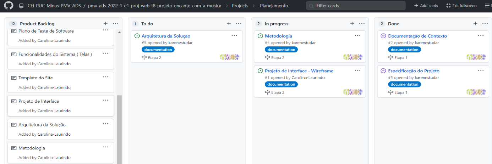

# Metodologia

Pré-requisitos: <a href="2-Especificação do Projeto.md"> Documentação de Especificação</a>

A metodologia contempla as definições de ferramenta utilizado pela equipe tanto para a manutenção dos códigos e demais artefatos quanto para a organização do time na execução das tarefas do projeto. 

### Relação de Ambientes de Trabalho 

Os artefatos do projeto são desenvolvidos a partir de diversas plataformas e a relação dos ambientes com seu respectivo propósito é apresentada na tabela que se segue.  

| Ambiente  | Plataforma | Link de Acesso | 
| ------------------- | ----------------|---------------|
|  Repositório de código fonte |  GitHub |  https://github.com/ICEI-PUC-Minas-PMV-ADS/pmv-ads-2022-1-e1-proj-web-t8-projeto-encante-com-a-musica|
|  Documentos do projeto | GitHub | https://github.com/ICEI-PUC-Minas-PMV-ADS/pmv-ads-2022-1-e1-proj-web-t8-projeto-encante-com-a-musica| 
|  Projeto de Interface e Wireframes |MarvelApp |https://marvelapp.com/4hd6091 |
|  Gerenciamento do Projeto |GitHub |https://github.com/ICEI-PUC-Minas-PMV-ADS/pmv-ads-2022-1-e1-proj-web-t8-projeto-encante-com-a-musica/projects/1 |

## Gestão de código fonte 

Para gestão do código fonte do software desenvolvido pela equipe, o grupo utiliza um processo baseado no Git Flow abordado por Vietro (2015), mostrado na Figura a seguir. Desta forma, todas as manutenções no código são realizadas em branches separados, identificados como Hotfix, Release, Develop e Feature. Uma explicação rápida sobre este processo é apresentada no vídeo "The gitflow workflow - in less than 5 mins". 

Figura X - Fluxo de controle do código fonte no repositório git

## Gerenciamento de Projeto

A equipe utiliza metodologias ágeis, tendo escolhido o Scrum como base para definição do processo de desenvolvimento. 

A equipe está organizada da seguinte maneira: 

**Scrum Master:** Carolina Laurindo 

**Product Owner:** Jeferson Queiroz 

**Equipe de Desenvolvimento:** 
Carolina Laurindo,
Cláudia Carapiá, 
Douglas Raynner, 
Jeferson Queiroz,
Karen Noguti, 
Phillipe Magno

**Equipe de Design:** 
Phillipe Magno 

Para organização e distribuição das tarefas do projeto, a equipe está utilizando o GitHub estruturado com as seguintes listas:  

**Recursos:** esta lista mantém template de tarefas recorrentes com as configurações padronizadas que todos devem seguir. O objetivo é permitir a cópia destes templates para agilizar a criação de novos cartões. 

**Backlog:** recebe as tarefas a serem trabalhadas e representa o Product Backlog. Todas as atividades identificadas no decorrer do projeto também devem ser incorporadas a esta lista. 

**To Do:** Esta lista representa o Sprint Backlog. Este é o Sprint atual que estamos trabalhando. 

**Doing:** Quando uma tarefa tiver sido iniciada, ela é movida para cá. 

**Done:** nesta lista são colocadas as tarefas que passaram pelos testes e controle de qualidade e estão prontos para ser entregues ao usuário. Não há mais edições ou revisões necessárias, ele está agendado e pronto para a ação. 

O quadro kanban do grupo no GitHub está disponível através da URL https://github.com/ICEI-PUC-Minas-PMV-ADS/pmv-ads-2022-1-e1-proj-web-t8-projeto-encante-com-a-musica/projects?type=beta e é apresentado, no estado atual, na Figura X. A definição desta estrutura se baseou na proposta feita por Littlefield (2016).

Figura X - Tela do kanban utilizada pelo grupo

A tarefas são, ainda, etiquetadas em função da natureza da atividade e seguem o seguinte esquema de cores/categorias:
-Bug
-	Documentação
-	Duplicado 
-	Melhoria 
-	Primeira boa edição
-	Procura-se ajuda
-	Inválido
-	Problema 

> **Links Úteis**:
> - [11 Passos Essenciais para Implantar Scrum no seu 
> Projeto](https://mindmaster.com.br/scrum-11-passos/)
> - [Scrum em 9 minutos](https://www.youtube.com/watch?v=XfvQWnRgxG0)

