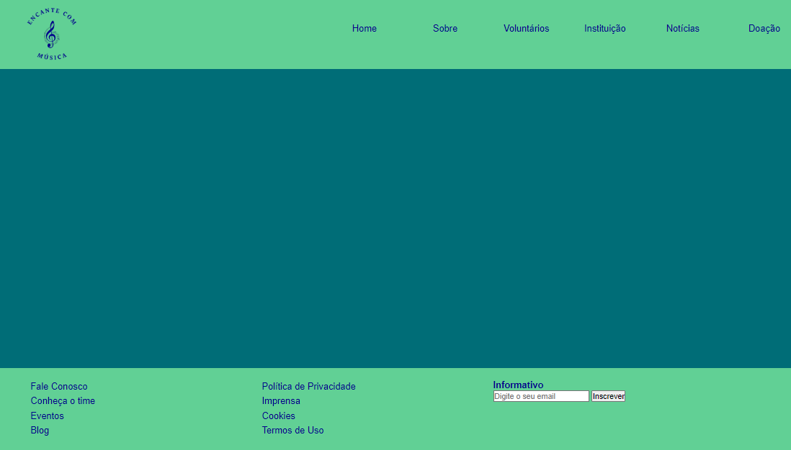
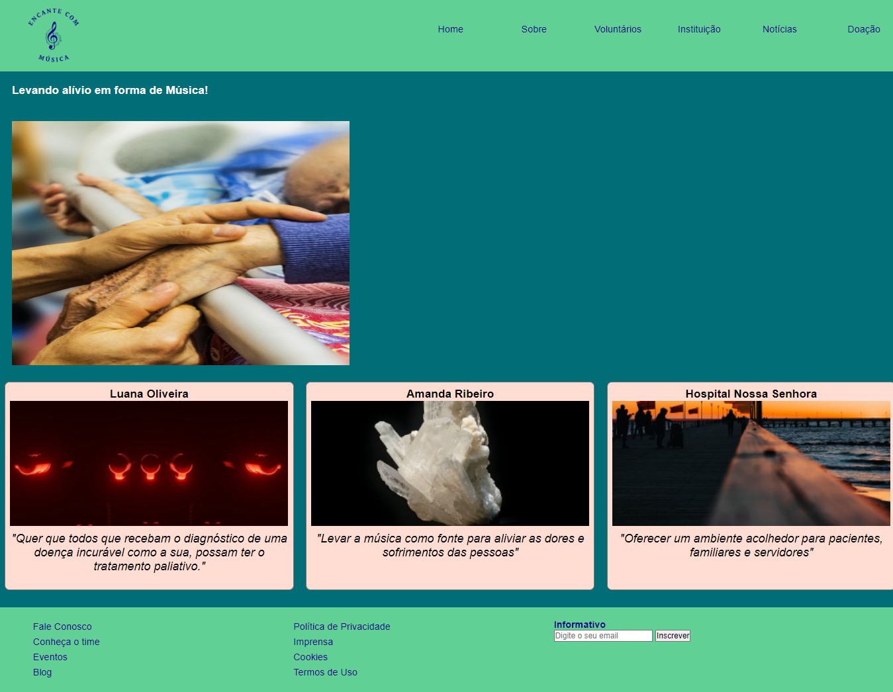

# Template padrão do site

Pré-requisitos: <a href="2-Especificação do Projeto.md"> Especificação do Projeto</a>, <a href="3-Projeto de Interface.md"> Projeto de Interface</a>, <a href="4-Metodologia.md"> Metodologia</a>

O padrão de layout a ser utilizado pelo site tem correspondência ao projeto de Interface elaborado anteriormente, conforme Figura X.

O template criado está disponível no site https://github.com/ICEI-PUC-Minas-PMV-ADS/pmv-ads-2022-1-e1-proj-web-t8-projeto-encante-com-a-musica/tree/main/src/Template  e é composto pelo seguinte layout: 

● Tela Página Inicial  

A responsividade segue o padrão Viewport e Media Queries.
### Tela - Página Inicial

Tela que abrange todas as visualizações iniciais do site.  

**Responsável:**  Jeferson Queiroz 

A página Inicial mostrará no cabeçalho um Menu (Home, Sobre, Voluntários, Instituição, Notícia e Doação) e submenu, pois através destes links o usuário poderá acessar outras funcionalidades do sistema. No Conteúdo, o usuário poderá conhecer qual o objetivo do projeto e depoimentos dos participantes, porém a página ainda não está pronta e as imagens colocadas são links da internet, conforme o Professor Hommel ensinou linkar. Já no rodapé, será possível acessar outras funcionalidades, já que terá um submenu com mais informações sobre o projeto como: Fale Conosco, Conheça o Time, Eventos, Blog, Política de Privacidade, Imprensa, Cookies e Termos de Uso. Além disso, o usuário poderá digitar seu e-mail para receber boletins informativos.   

**O que foi desenvolvido/estudado:**

Para desenvolvimento da página foi utilizado o HTML e CSS, conteúdos estes, estudados no micro fundamento Desenvolvimento Web front-end.  
Minha maior dificuldade foi colocar o Submenu, pois devido ao conhecimento de iniciante em HTML e CSS, não conseguia colocar o submenu dentro do Menu e depois que consegui resolver o problema no HTML, não conseguiu configurar o CSS de forma correta e os elementos ficavam desalinhados. Já no rodapé, a dificuldade foi instalar o informativo e caixa de e-mail, pois não conseguia fazer o alinhamento.

**Cópia da tela iniciada/estudada:**    

**Instruções de acesso:**    

● Abra um navegador de Internet e informe a seguinte URL: http://127.0.0.1:5501/src/P%C3%A1gina%20Inicial/index.html    

● A tela página inicial é a primeira funcionalidade exibida pelo aplicativo.  

