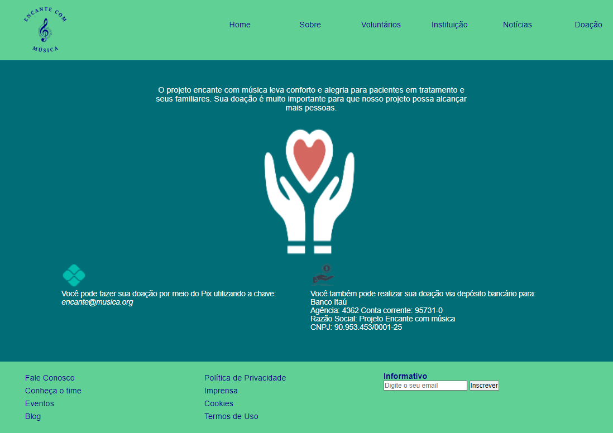
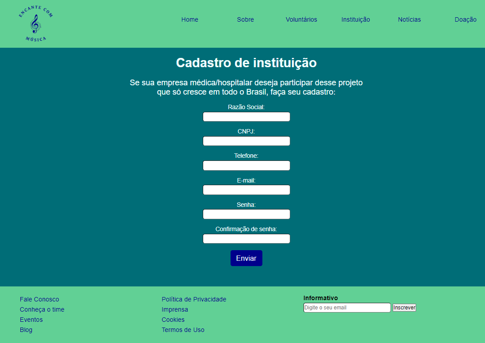
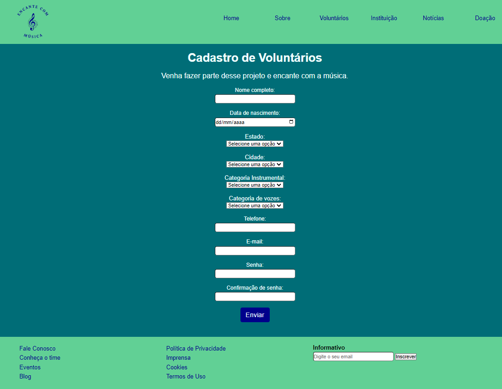
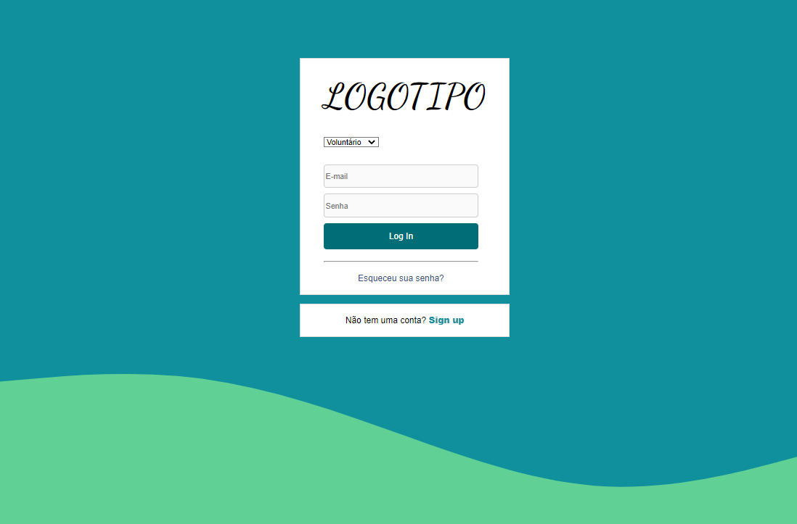

# Programação de Funcionalidades

Pré-requisitos: <a href="2-Especificação do Projeto.md"> Especificação do Projeto</a>, <a href="3-Projeto de Interface.md"> Projeto de Interface</a>, <a href="4-Metodologia.md"> Metodologia</a>, <a href="3-Projeto de Interface.md"> Projeto de Interface</a>, <a href="5-Arquitetura da Solução.md"> Arquitetura da Solução</a>

Implementação do sistema descritas por meio dos requisitos funcionais e/ou não funcionais. Deve relacionar os requisitos atendidos os artefatos criados (código fonte) além das estruturas de dados utilizadas e as instruções para acesso e verificação da implementação que deve estar funcional no ambiente de hospedagem.

Para cada requisito funcional, pode ser entregue um artefato desse tipo.

Nesta seção são apresentadas as telas desenvolvidas para cada uma das funcionalidades do sistema. O respectivo endereço (URL) e outras orientações de acesso são apresentadas na sequência.

## Visualização de Tela Fale Conosco (RF-10, RF-13 e RF-14)

**Responsável:**  Karen Noguti 

 
A tela Fale Conosco apresenta os dados do mantenedor do site. Além disso, é uma ferramenta que o usuário poderá utilizar para contactar o Projeto através de mensagem de texto, mas para isto será necessário preencher dados pessoais como Nome Completo, E-mail e Telefone.   

O campo “Quem” é possível selecionar: Voluntário, Paciente, Familiar, Instituição e Outros, já no campo “Assunto” o usuário poderá escolher por: Dúvida, Solicitação de Visita, Sugestão, Reclamação e Outros. Após escrever a mensagem de texto e clicar em Enviar a solicitação será processada.   

**O que foi desenvolvido/estudado:**

Para desenvolvimento da página foi utilizado o HTML e CSS, conteúdos estes, estudados principalmente no micro fundamento Desenvolvimento Web front-end. 

 
A maior dificuldade e problema no desenvolvimento da tela foi quanto ao CSS e responsividade, pois devido ao conhecimento de iniciante sobre a ferramenta, tive dificuldade em posicionar os elementos e apesar de ter responsividade de Media Query a funcionalidade ainda não está 100%. 

**Cópia da tela iniciada/estudada:** 

**Endereço do vídeo:**

## Etapa 3

### Tela - Fale Conosco

**Responsável:**  Karen Noguti

**O que foi desenvolvido/estudado:**

**Cópia da tela iniciada/estudada:** 

**Endereço do vídeo:**

### Visualização da Tela Doação (RF-09)

**Responsável:**  Carolina Laurindo

A página doação apresenta em seu conteúdo principal, informações para que o usuário possa apoiar financeiramente o projeto. São mostradas as duas formas de depósito, por PIX e depósito de conta bancária, e os dados necessários para a realização do mesmo. 

**O que foi desenvolvido/estudado:** Para o desenvolvimento da página, utilizei os conhecimentos adquiridos no microfundamento de desenvolvimento web front-end. A página contém imagens  decorativas e textos que informam ao usuário como fazer sua doação. Foram usadas propriedades do css para fazer a formatação e o alinhamento dos itens e o recurso de media query para fazer a responsividade do site, que ainda está em desenvolvimento. As maiores dificuldades que tive nessa etapa foram fazer a responsividade da página,alinhar as imagens e textos e fazer o posicionamento dos itens na página para que ficassem dentro da área reservada ao conteúdo principal.

**Endereço do vídeo:** https://github.com/ICEI-PUC-Minas-PMV-ADS/pmv-ads-2022-1-e1-proj-web-t8-projeto-encante-com-a-musica/blob/main/presentation/Etapa%203/video%20etapa3.mp4

### Visualização da Tela Cadastro de instituição (RF-05)

**Responsável:**  Cláudia Carapiá Ferraz

A tela Cadastro de Instituição apresenta o cabeçalho padrão do site com o logotipo e menu de navegação (Home, Sobre, Voluntários, Instituição, Notícias e Doação).  

O conteúdo principal da página consiste em um formulário para preenchimento pela Instituição interessada em se cadastrar no projeto. Este formulário possui os seguintes campos para preenchimento: Razão social, CNPJ, Telefone, E-mail, Senha, Confirmação de senha.  

**O que foi desenvolvido/estudado:**

Para o desenvolvimento da página foi utilizado o HTML e CSS, conteúdos estes, estudados no micro fundamento Desenvolvimento Web front-end. Tentei implementar o que foi ensinado na criação da tela Cadastro de Instituição. A tela consiste em um formulário de cadastro simples e ainda está em construção. A página ainda não está finalizada, pois tive dificuldade em criar o campo para escolha de cidade e estado, estou estudando a parte do microfundamento sobre javascript para tentar implementar uma solução utilizando json. Além disso, estou tendo dificuldade em fazer a responsividade da página. 

**Cópia da tela iniciada/estudada:** 

 

**Endereço do vídeo:** https://github.com/ICEI-PUC-Minas-PMV-ADS/pmv-ads-2022-1-e1-proj-web-t8-projeto-encante-com-a-musica/blob/main/presentation/Etapa%203/video%20etapa%203%20-%20Cl%C3%A1udia.mkv 

### Visualização da tela Cadastro de voluntários (RF-04)

**Responsável:**  Douglas Raynner

A tela se baseia em um formulário de cadastro simples, no qual ainda não foi acabado, para que as pessoas interessadas possam se inscrever.

**O que foi desenvolvido/estudado:** Foi estudado o microfundamento de desenvolvimento web front end e implementei o conteúdo na criação da tela de cadastro de voluntários. 

**Cópia da tela iniciada/estudada:**

**Endereço do vídeo:** https://youtu.be/Z50E5QB9DMI

### Visualização da Tela de Login (RF-04 e RF-05)

**Responsável:**  Phillipe Magno

Na Tela de Login, o usuário poderá escolher uma das opções, logar como Voluntário ou logar como instituição.  

**O que foi desenvolvido/estudado:**

**Cópia da tela iniciada/estudada:**

**Endereço do vídeo:**
