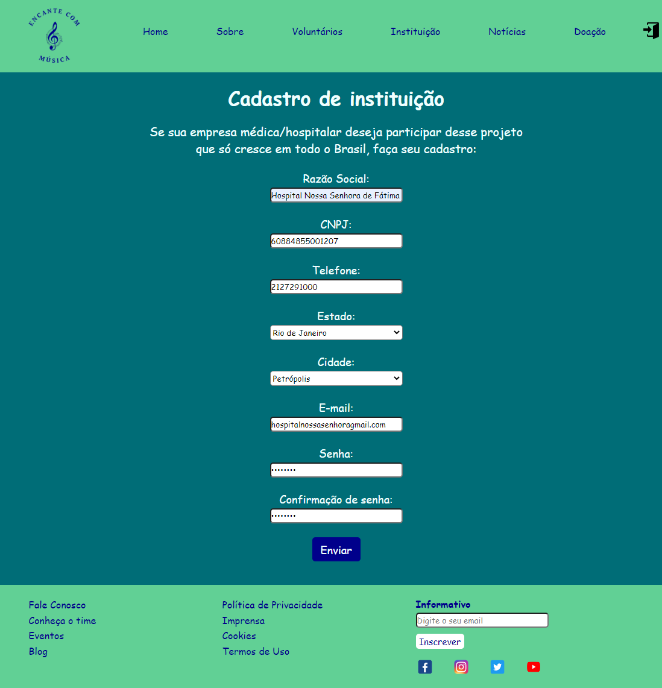

# Registro de Testes de Software

Pré-requisitos: <a href="3-Projeto de Interface.md"> Projeto de Interface</a>, <a href="8-Plano de Testes de Software.md"> Plano de Testes de Software</a>

Relatório com as evidências dos testes de software realizados no sistema pela equipe, baseado em um plano de testes pré-definido.

Os resultados obtidos nos testes de software realizados são descritos abaixo. 

|Caso de Teste|CT-01 – Links da Página Fale Conosco – Antes da integração|
|-----|-----|
|Objetivo do Teste|Verificar se todos os links que estão na página Fale Conosco e que direcionam para outras páginas estão funcionando. |
|Critérios de Êxito|Todos os links ao serem clicados devem direcionar para a página correspondente; |
|Registro de Execução  |Êxito no teste.  |

|Caso de Teste|CT-02 – Campos de formulário da Página Fale Conosco – Antes da integração |
|-----|-----|
|Objetivo do Teste|Verificar se somente depois que todos os campos tiverem sido preenchidos corretamente é que o usuário conseguirá enviar o formulário|
|Critérios de Êxito|Os campos Nome e Sobrenome só poderá aceitar letras;  No campo E-mail o usuário deverá colocar um e-mail válido conforme: example@example.com;  Nos Campos “Quem” e “Assunto” ao clicar em selecionar, as opções disponíveis devem ser visualizadas;  O Campo “Mensagem” deverá possibilitar ao usuário escrever uma mensagem.  Após todos os campos preenchidos, se o usuário tiver inserido corretamente as informações, o formulário será enviado. Caso contrário, deverá retornar uma mensagem no campo preenchido incorretamente.|
|Registro de Execução  |Êxito no teste.  |

|Casos de Teste|CT-03 – Listar “Todas” da Página Busque por Instituições - Antes da integração |
|-----|-----|
|Objetivo do Teste  |RF-07 - O site deve permitir que o voluntário pesquise instituições e grupos cadastrados.  RF-08 - O site deve permitir que o voluntário pesquise locais em sua região que precisem de voluntários. |
|Critérios de Êxito|Verificar se ao clicar em “Todas” a página carrega todas as instituições que estão no banco de dados.|
|Registro de Execução|Êxito no teste.|

|Casos de Teste|CT-04 – Links da página de cadastro de instituição - Antes da integração |
|-----|-----|
|Objetivo do Teste  |Verificar se os links do menu de navegação da página de cadastro de instituição estão funcionando e direcionando para a página correspondente. |
|Critérios de Êxito|Todos os links ao serem clicados devem direcionar para a página correspondente|
|Registro de Execução|Êxito no teste.|

|Casos de Teste|CT-05 – Campos de formulário da página Cadastro de Instituição - Antes da integração |
|-----|-----|
|Objetivo do Teste  |Verificar se somente depois que todos os campos tiverem sido preenchidos corretamente é que o usuário conseguirá enviar o formulário. |
|Critérios de Êxito|O campo CNPJ só devem aceitar números.   O campo e-mail deve aceitar somente um e-mail válido.  O campo senha e confirmação de senha devem ter os caracteres substituídos por símbolos para garantir a segurança do conteúdo. |
|Registro de Execução|Êxito no teste.|

## Caso de Teste 05 - Print da tela

|Casos de Teste|CT-06 – Links da página de informações sobre o tratamento paliativo – Antes da integração |
|-----|-----|
|Objetivo do Teste  |Verificar se a página apresenta links que direcionam para artigos científicos e se estão direcionando corretamente.|
|Critérios de Êxito|Todos os links apresentados devem direcionam para artigos científicos em outras páginas web.|
|Registro de Execução|Êxito no teste.|

|Casos de Teste|CT-07 – Links da home page - Antes da integração|
|-----|-----|
|Objetivo do Teste  |Verificar se todos os links localizados na home page estão sendo direcionados para as outras páginas corretamente|
|Critérios de Êxito|Todos os links da página devem ser direcionados as outras páginas corretamente|
|Registro de Execução|Êxito no teste.|

|Casos de Teste|CT-08 – Visualizar voluntários cadastrados da página Busque por Voluntários - Antes da Integração  |
|-----|-----|
|Objetivo do Teste  |Verificar se o banco de dados contendo os dados dos voluntários será carregado corretamente |
|Critérios de Êxito|Ao clicar no botão "Voluntários cadastrados" deverá aparecer na tela as informações dos voluntários cadastrados no banco de dados|
|Registro de Execução|Êxito no teste.|

|Casos de Teste| CT-09 – Visualizar grupos  cadastrados da página Busque por Voluntários - Antes da Integração |
|-----|-----|
|Objetivo do Teste  |Verificar se o banco de dados contendo os dados dos grupos cadastrados será carregado corretamente |
|Critérios de Êxito|Ao clicar no botão "Grupos cadastrados" deverá aparecer na tela as informações dos voluntários cadastrados no banco de dados|
|Registro de Execução|Êxito no teste.|
