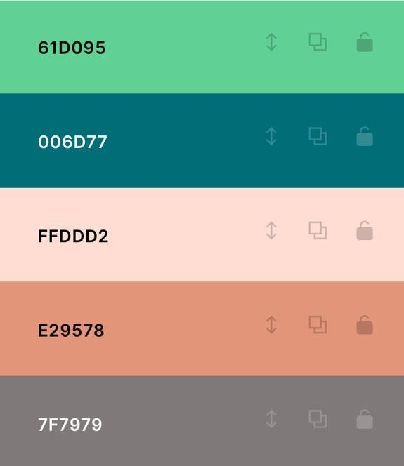

# Apresentação

## Título do Projeto

# Encante com Música

## Identidade Visual (Marca, Design).

O grupo fez um estudo de cores e escolheu a paleta de cores abaixo para utilizar no projeto:

## Logotipo

## Conjunto de Slides (Estrutura)

 https://github.com/ICEI-PUC-Minas-PMV-ADS/pmv-ads-2022-1-e1-proj-web-t8-projeto-encante-com-a-musica/blob/main/presentation/Etapa%205/apresenta%C3%A7%C3%A3o.pdf

