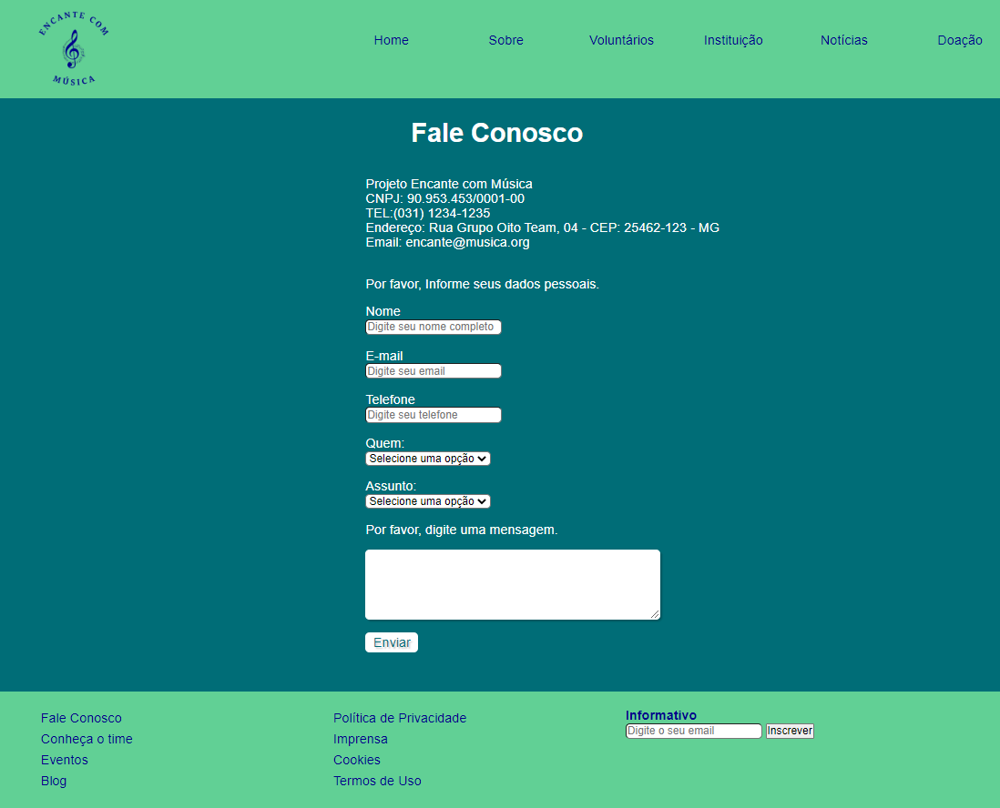
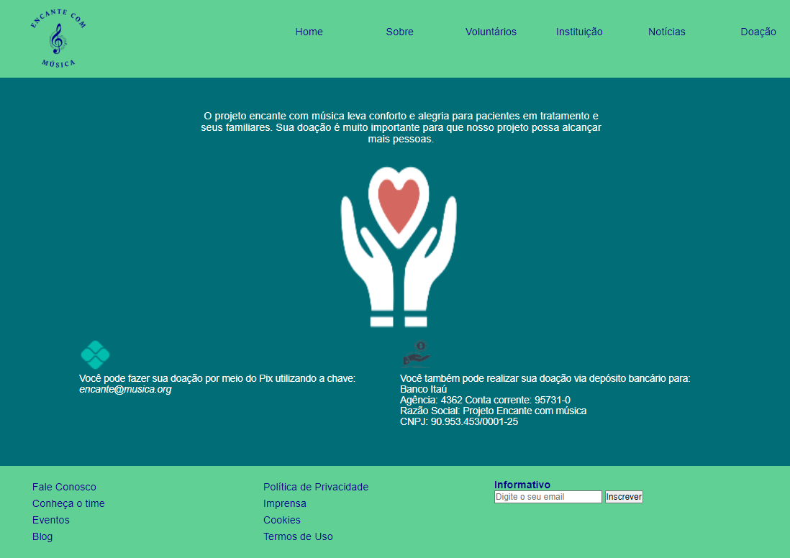
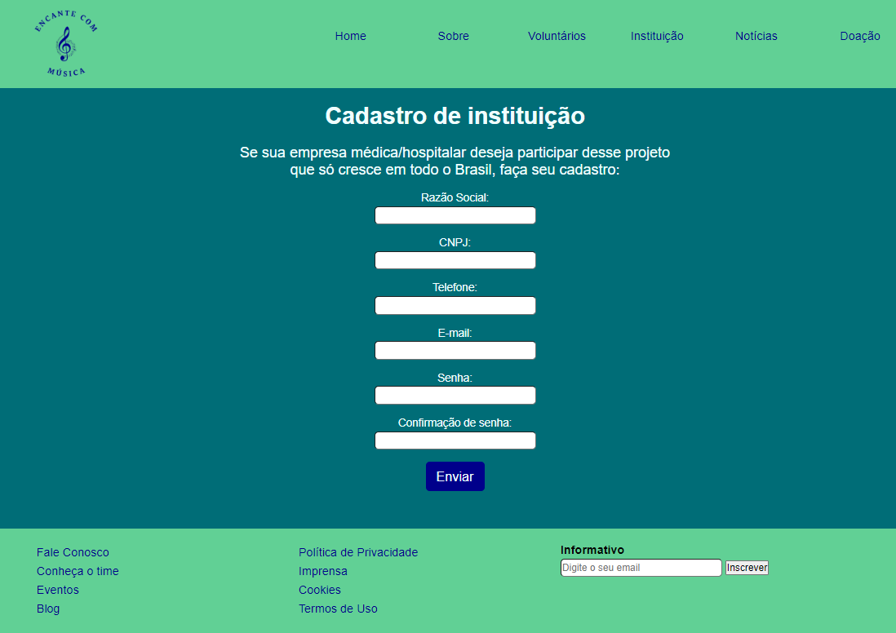

# Apresentação da Solução

Faça uma apresentação de um resumo de todos o processo de desenvolvimento e no final apresente a solução desenvolvida, usando um pequeno vídeo.

## Etapa 3

**Tela** - **Homepage:**

**Responsável:**  

**O que foi desenvolvido/estudado:**

**Cópia da tela iniciada/estudada:**

**Endereço do vídeo:**

**Tela** - **Fale Conosco:**

**Responsável:**  

**O que foi desenvolvido/estudado:**

**Cópia da tela iniciada/estudada:** 

**Endereço do vídeo:**

**Tela** - **Doação:**

**Responsável:**  

**O que foi desenvolvido/estudado:**

**Cópia da tela iniciada/estudada:** 

**Endereço do vídeo:**

**Tela** - **Cadastro de instituição:**

**Responsável:**  Cláudia Carapiá Ferraz

**O que foi desenvolvido/estudado:** Durante a semana, eu estudei o microfundamento de desenvolvimento web front-end e tentei implementar o que foi ensinado na criação da tela Cadastro de Instituição. A tela consiste em um formulário de cadastro simples e ainda está em construção, não está finalizada. 

**Cópia da tela iniciada/estudada:**

 

**Endereço do vídeo:**

**Tela** - **Cadastro de voluntários:**

**Responsável:**  

**O que foi desenvolvido/estudado:**

**Cópia da tela iniciada/estudada:**

**Endereço do vídeo:**

**Tela** - **Login:**

**Responsável:**  

**O que foi desenvolvido/estudado:**

**Cópia da tela iniciada/estudada:**

**Endereço do vídeo:**
